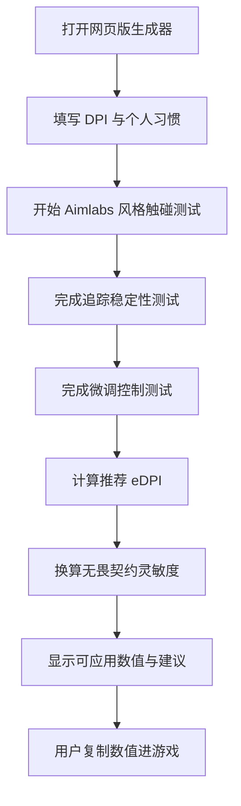

## 1. 产品概述
无畏契约专属灵敏度生成器是一个单文件网页版工具，通过内嵌 Aimlabs 风格触碰式瞄准测试、追踪测试、微调测试和习惯问卷，生成可直接输入《无畏契约》当前版本使用的游戏内灵敏度数值。
- 解决玩家难以根据自身鼠标习惯、DPI、瞄准表现推导合适灵敏度的问题。
- 目标用户是《无畏契约》玩家，尤其是希望获得可应用、可复测、可微调灵敏度方案的用户。

## 2. 核心功能

### 2.1 功能模块
1. **个人习惯输入区**：DPI、当前游戏灵敏度、鼠标垫大小、偏好类型、惯用武器/定位。
2. **Aimlabs 风格触碰测试**：目标出现后，鼠标准星移动碰到目标即触发命中，不需要点击。
3. **追踪稳定性测试**：移动目标在限定区域内移动，检测准星贴近目标的时间比例。
4. **微调控制测试**：小目标短距离出现，用于判断当前灵敏度是否过高或过低。
5. **结果生成区**：输出无畏契约游戏内灵敏度、eDPI、建议范围、推荐调整原因。
6. **复测与应用提示**：允许用户重新测试，并提示如何把数值输入游戏设置。

### 2.2 页面详情
| 页面名称 | 模块名称 | 功能描述 |
|---|---|---|
| 单页应用 | 顶部标题区 | 展示产品名称、用途、当前流程提示 |
| 单页应用 | 习惯输入卡片 | 输入 DPI、当前灵敏度、偏好、鼠标垫空间 |
| 单页应用 | 测试面板 | 内嵌准星、倒计时、目标、分数、命中/贴近判定 |
| 单页应用 | 结果卡片 | 根据测试表现生成可用于无畏契约的灵敏度数值 |
| 单页应用 | 调整说明 | 解释灵敏度如何应用，以及推荐值的依据 |

## 3. 核心流程
用户输入个人习惯和 DPI 后，依次完成触碰式瞄准测试、追踪测试和微调测试。系统根据命中速度、准确度、追踪稳定性、微调误差以及用户偏好计算推荐 eDPI，再换算为无畏契约游戏内灵敏度。输出值保留 3 位小数，保证能直接填入游戏。

## 4. 用户界面设计

### 4.1 设计风格
- 主色：深夜蓝黑、枪械金属灰。
- 辅色：无畏契约红、战术青、低饱和绿色。
- 按钮：锐利切角、硬边边框、强对比悬停状态。
- 字体：使用浏览器可用字体栈，标题偏窄体、正文清晰易读。
- 布局：桌面优先，左侧输入/结果，右侧大面积测试区域。
- 动效：目标出现、命中脉冲、倒计时切换、结果卡片展开。

### 4.2 页面设计概览
| 页面名称 | 模块名称 | UI 元素 |
|---|---|---|
| 单页应用 | 英雄标题 | 战术网格背景、红色强调线、版本提示 |
| 单页应用 | 输入面板 | 表单、滑块、选择按钮、数据摘要 |
| 单页应用 | 测试区域 | 深色靶场、准星、触碰目标、倒计时、实时状态 |
| 单页应用 | 结果区域 | 推荐灵敏度、eDPI、可信度、调整理由 |

### 4.3 响应式
桌面优先，移动端改为单列布局。测试区域在移动端保持可用，但核心目标是鼠标设备下使用。