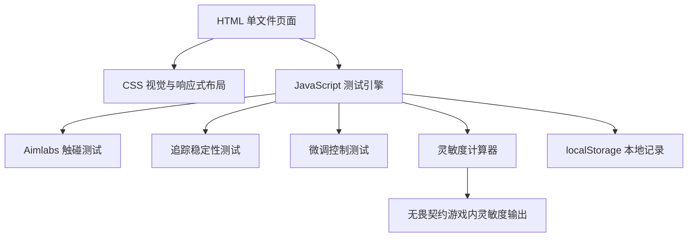

## 1. 架构设计

## 2. 技术说明
- 前端：原生 HTML5 + CSS3 + JavaScript。
- 文件形态：单个 `aim.html`，不生成 exe，不依赖后端。
- 交互：使用 Pointer Lock API 获取鼠标移动，测试区内显示自定义准星。
- 计时：使用 `requestAnimationFrame` 驱动倒计时与测试循环，避免倒计时卡住。
- 数据保存：使用 localStorage 保存最近一次输入和推荐结果。

## 3. 路由定义
| 路由 | 用途 |
|---|---|
| aim.html | 无畏契约灵敏度生成器主页面 |

## 4. 核心计算规则
- 用户输入 DPI 后，推荐灵敏度按 `推荐灵敏度 = 推荐 eDPI / DPI` 换算。
- 输出灵敏度保留 3 位小数，限制在无畏契约常用可用范围内，例如 `0.050` 到 `2.000`。
- 初始参考 eDPI 区间：低灵敏 `180-240`，平衡 `240-320`，高灵敏 `320-420`。
- 根据测试结果调整：
  - 命中速度慢且追踪稳定：略提高 eDPI。
  - 命中快但微调误差大：降低 eDPI。
  - 追踪贴近率低：根据偏好小幅调整，避免极端跳变。
  - 鼠标垫空间小：允许推荐值偏高；空间大：允许推荐值偏低。

## 5. 测试模块设计
| 模块 | 输入 | 输出 | 判定方式 |
|---|---|---|---|
| Aimlabs 触碰测试 | 鼠标移动 | 命中数、平均反应时间、误触次数 | 准星中心进入目标矩形即命中 |
| 追踪测试 | 鼠标移动 | 贴近率、平均偏离距离 | 准星与移动目标中心距离低于阈值计为贴近 |
| 微调测试 | 鼠标移动 | 小目标命中率、平均修正时间 | 小目标被准星触碰即命中 |

## 6. 无后端说明
本项目不需要后端、数据库或外部 API。所有测试、计算和结果展示都在浏览器本地完成。